# 115 Plus WinUI版本

基于 [115 网盘开放平台](https://open.115.com/) 的第三方开源桌面客户端，使用 **WinUI 技术** 构建，支持文件管理、下载、OSS 分片上传和视频播放。

本项目在GitHub上开源：[Win115](https://github.com/haozekang/Win115)，欢迎大家点个小星星~

## 首先
我也不知道该写些啥。先是吐槽一下115吧，没有PC客户端，很不自在！

## 其次
该项目还在发展，功能后续会陆续添加上的！

## 下载

Microsoft Store 搜索[115 Plus]

目前仅支持 Windows 平台，完善后基于 AvaloniaUI 研发跨端版本。

## 截图

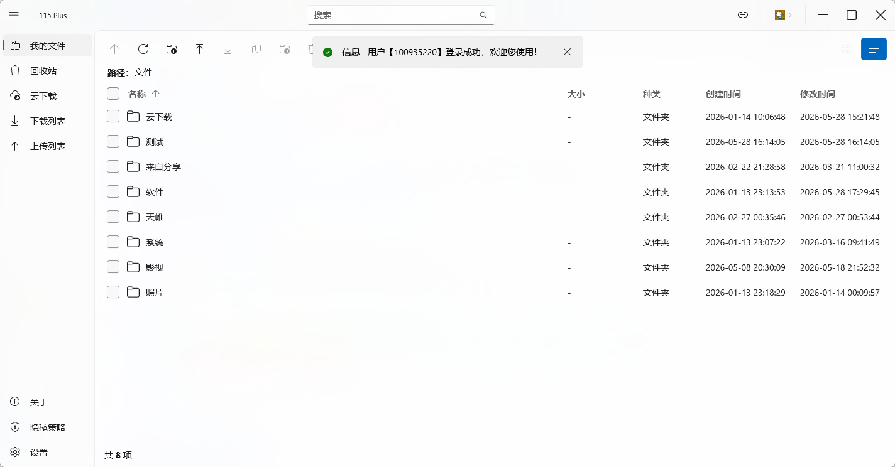
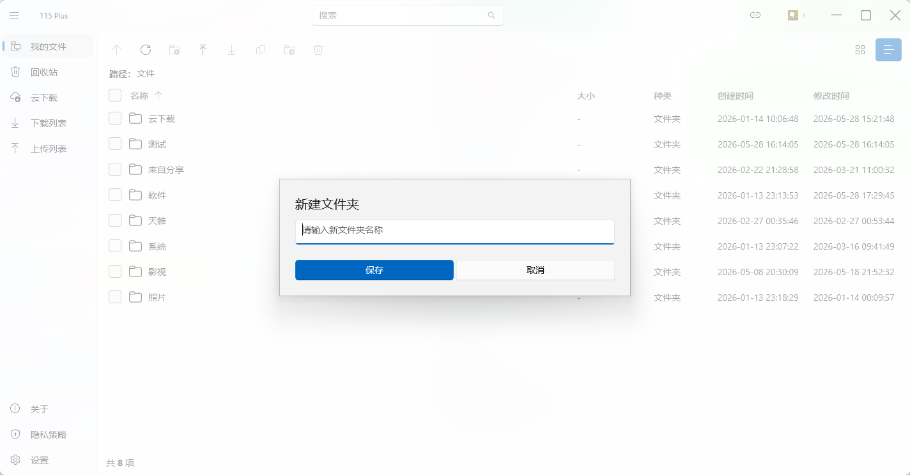
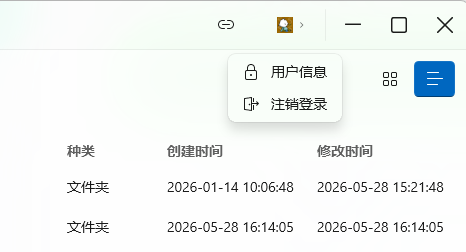
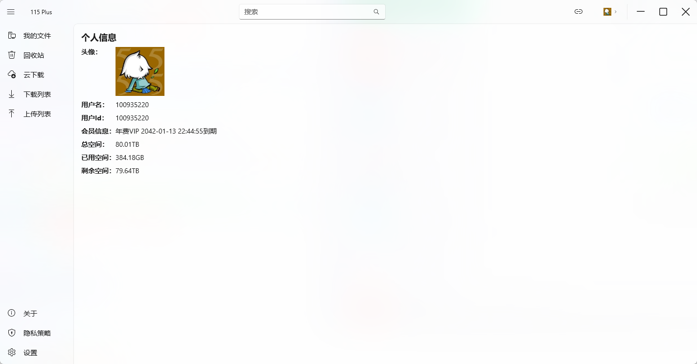

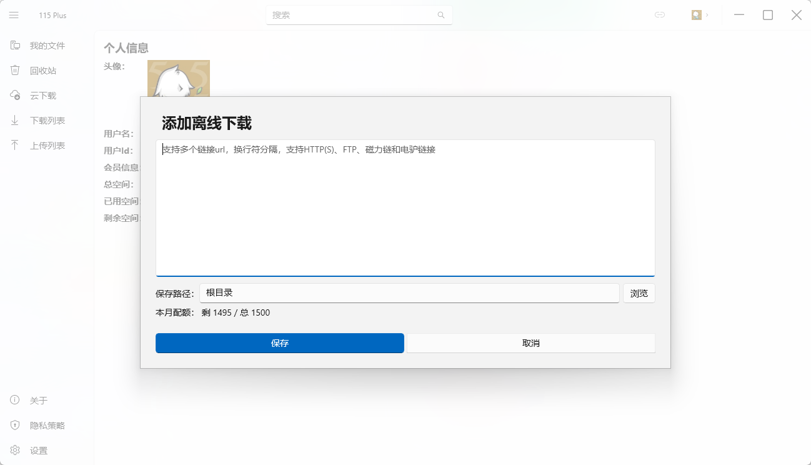
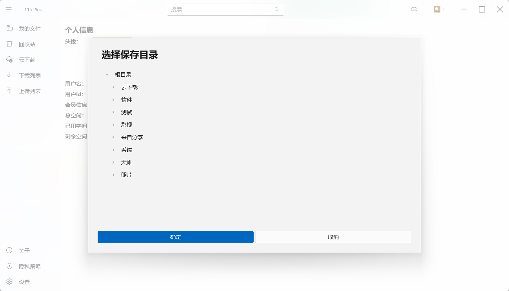
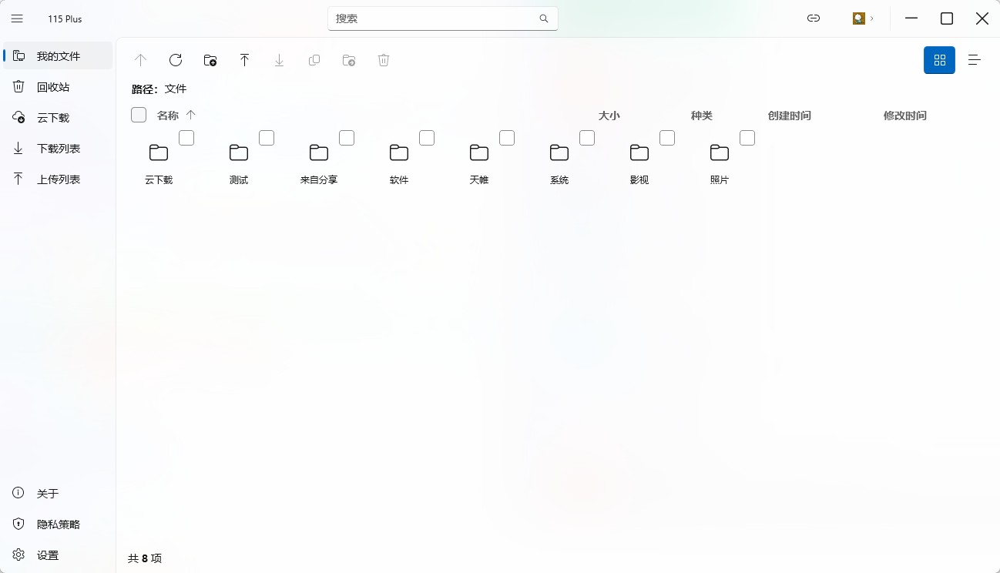
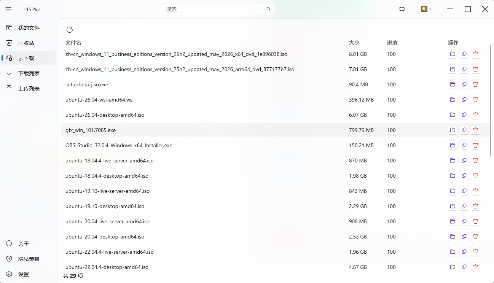
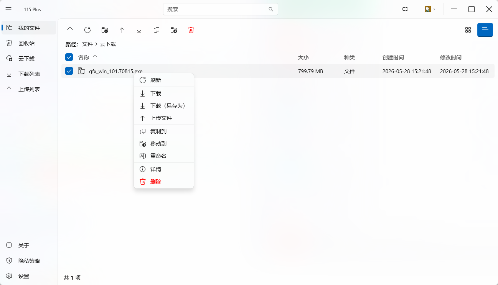
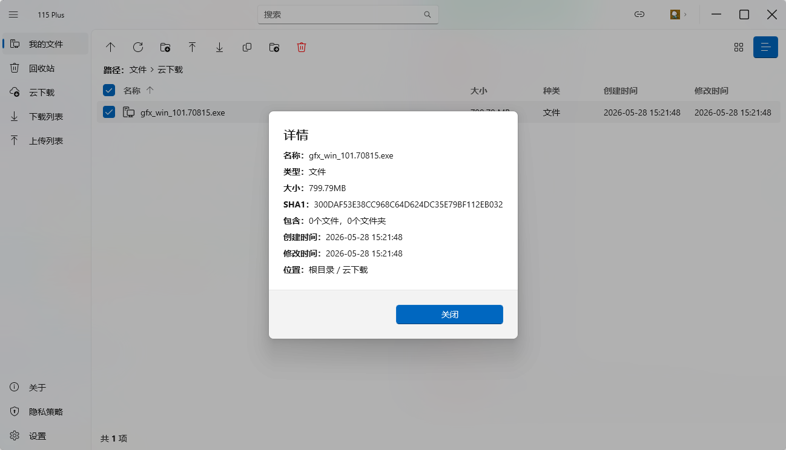
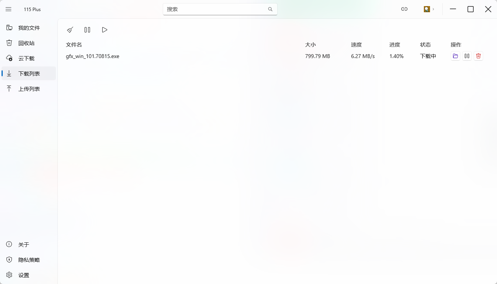
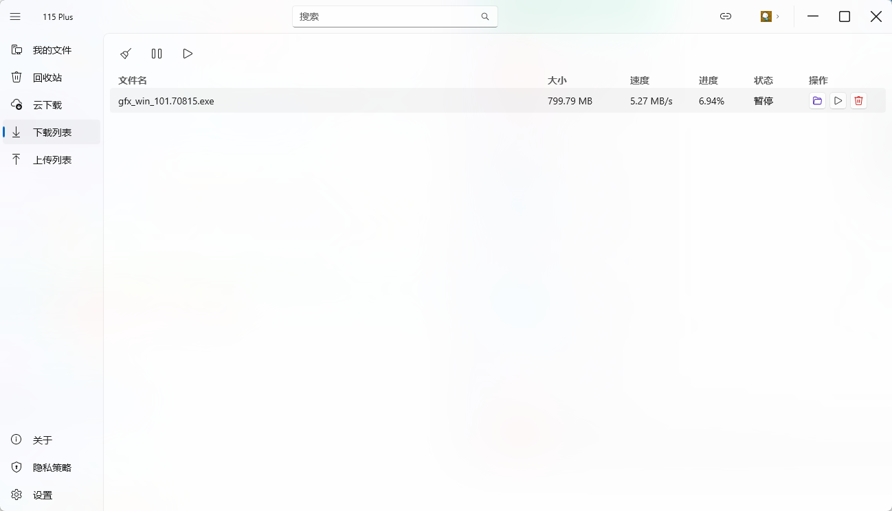
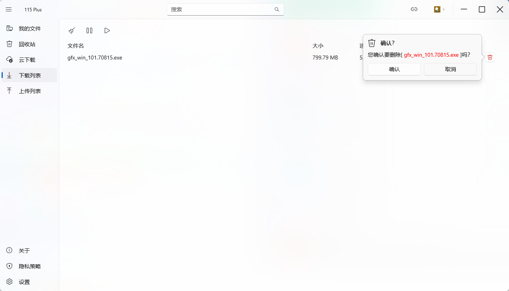
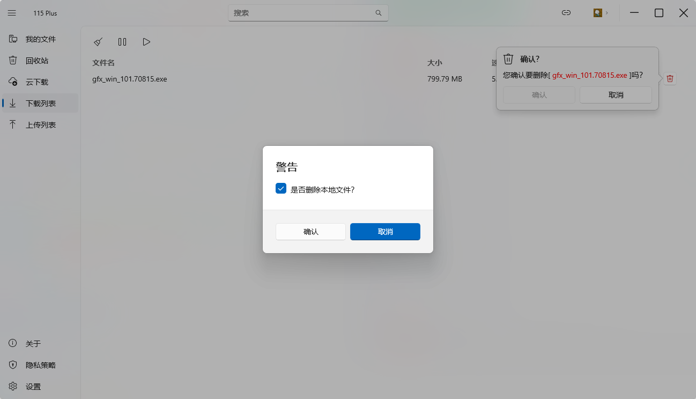
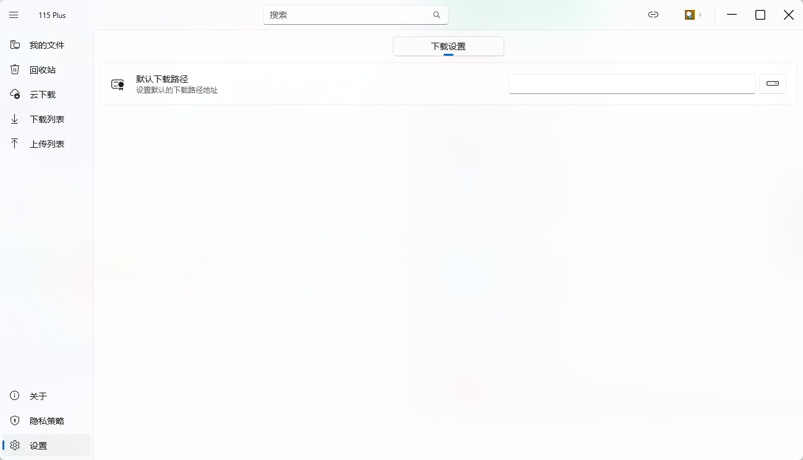
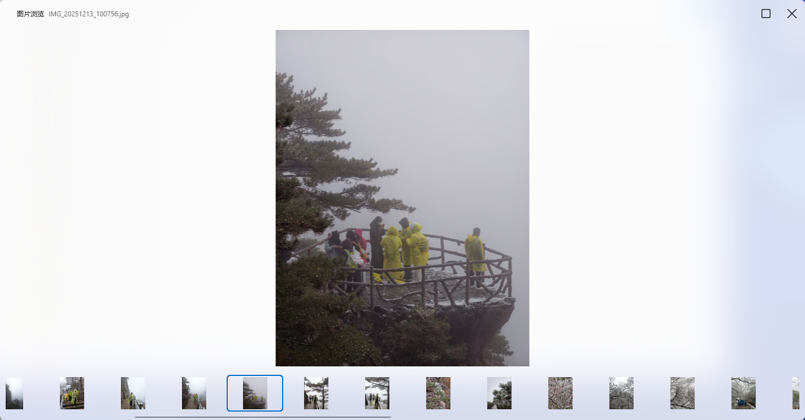
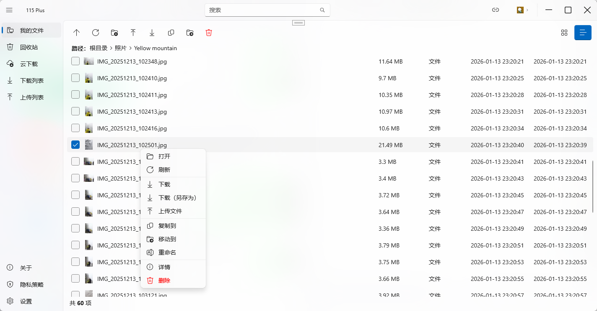
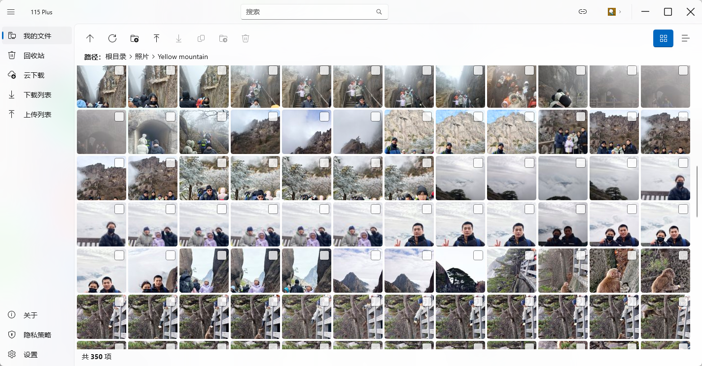

## 功能

### 特点功能

- 🚀 无感加载，告别分页：全局采用滚动自动加载机制，让数据浏览更连贯。
- 🖼️ 快捷预览，双击即看：支持右键或双击图片文件，秒开专属图片浏览窗口。
- 🔍 自由缩放，细节拉满：在预览窗口中，只需按住 Ctrl + 滚动鼠标滚轮，即可轻松放大或缩小查看细节。
- 🎨 直观展示，所见即所得：文件管理界面自动渲染真实缩略图，告别枯燥的默认图标。
- ⚡ 底层优化，极致丝滑：采用先进的异步处理与消息机制，彻底消除卡顿，体验如丝般顺滑~
- 🔮 战未来，全芯兼容：全面支持 ARM 与 x64 架构 CPU，无论是传统 PC 还是新一代设备，都能完美适配运行！
- 🏪 官方商店，一键安装：现已上架微软应用商店！直接搜索“115 Plus”即可一键下载安装，安全便捷，即刻开启体验！

### 用户

- [x] 手机扫码登录
- [x] 用户信息查看

### 文件管理

- [x] 文件/文件夹列表（支持列表/网格视图切换、自定义排序）
- [x] 文件（夹）删除
- [x] 新建文件夹
- [x] 文件详情查看
- [x] 文件搜索
- [x] 文件（夹）复制、移动、重命名

### 文件下载

- [x] 下载
- [ ] 文件夹递归下载
- [x] 下载暂停/恢复
- [x] 下载任务持久化（LiteDb）

### 文件上传

- [x] 文件上传
- [ ] 文件夹上传
- [x] OSS 分片上传（支持大文件）
- [x] 秒传检测（SHA1 预校验）
- [ ] 上传暂停/继续

### 视频播放

- [ ] 在线视频播放
- [ ] 播放进度记忆与恢复
- [ ] 视频字幕

### 云下载（离线下载）

- [x] 链接离线下载
- [ ] BT 种子解析下载
- [x] 云下载任务列表与管理
- [x] 下载配额查看
- [ ] 任务文件直接打开

### 回收站

- [x] 文件还原
- [x] 删除/清空回收站

### 系统

- [x] 深色/浅色主题（跟随系统）

## 致谢

项目很大程序上借鉴了115+的界面，感谢 [115+作者](https://github.com/lvzhenbo/115-plus-desktop) 的贡献支持。

## 许可证

[MIT](LICENSE)
